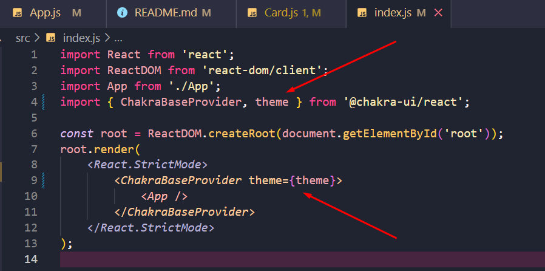

# Design-System-template-aula

Template no codesandbox:
https://codesandbox.io/s/template-aula-design-systems-chakra-mpcifz

## Índice

-   [1. Instalações](#instalações)
-   [2. Prática 1](#prática-1)
-   [3. Prática 2](#prática-2)
-   [4. Prática 3](#prática-3)
-   [5. Fixação](#fixação)

[link com enunciados](https://docs.google.com/presentation/d/e/2PACX-1vT1cZRej-3FlH63D3r77leM8Obeozt0dNVRgMXv9OQHdRMu-QqAPvrXhiW-LwY1OTiTUX24PLwJab3h/pub?start=false&loop=false&delayms=3000&slide=id.g164569922a2_1_7)

## Instalações

-   Para fazer a instalação do Chakra UI basta rodar o seguinte comando:

    ```
    npm i @chakra-ui/react @emotion/react @emotion/styled framer-motion
    ```

-   Após a instalação da Lib, precisamos **chamar** o `provider`, isso pode ser feito no `App.js` ou no `index.js`:

    -   Dentro do `App.js`:
        -   importar:
            ```
            (...)
            import { ChakraBaseProvider } from '@chakra-ui/react';
            ```
            (...)
        -   chamar:
            ```
            (...)
                return (
                <ChakraBaseProvider>
                    <h1>Me apague quando for iniciar!</h1>
                    <p>Chame o Card aqui!</p>
                </ChakraBaseProvider>
            );
            (...)
            ```
    -   Dentro do `index.js`:

        ```
        import React from 'react';
        import ReactDOM from 'react-dom/client';
        import App from './App';
        import { ChakraBaseProvider } from '@chakra-ui/react';

        const root = ReactDOM.createRoot(document.getElementById('root'));
        root.render(
            <React.StrictMode>
                <ChakraBaseProvider>
                    <App />
                </ChakraBaseProvider>
            </React.StrictMode>
        );
        ```

    -   Onde a importação do `Provider` foi feita, faça também, a importação do `theme` e passe-o como parâmetro para o componente `ChakraBaseProvider`:
        

## Prática 1

- As práticas 1 e 2 foram resolvidas juntas.

## Prática 2

### Resolução
-   Nesse [link](https://chakra-templates.dev/components/cards) vou escolher um card, copiar o código
-   Depois, em `src` criar uma pasta chamada `components` e dentro dela um arquivo chamado `Card.js`, em seguida colo o código dentro desse arquivo
-   Pego o nome do componente e chamo no `App.js`

## Prática 3

### Resolução

-   Em `App.js` fazer um map de users e chamar o componente do Chakra dentro do retorno:

    ```
    (...)
    return (
        <>
            {users.map((user) => {
                return <ProductSimple />;
            })}
        </>
    );
    (...)
    ```

-   Passar os `users` por props:
    ```
    (...)
    return (
        <>
            {users.map((user) => {
                return <ProductSimple key={user.id} user={user} />;
            })}
        </>
    );
    (...)
    ```
-   No componente `Card.js` faço as trocas desejadas:
    -   **Importante:** Não esquecer de receber por propsa as informações dentro do componente para poder referencia-la quando necessário:
        ```
        (...)
        export default function ProductSimple({ user }) {
        (...)
        ```
    -   Para imagem aleatória usei esse site: [picsum](https://picsum.photos/)
    -   E para criar uma imagem aleatória modifiquei a url de uma das imagens da seguinte forma:
        -   antes:
            ```
            https://picsum.photos/seed/picsum/200/300
            ```
        -   depois:
            ```
            `https://picsum.photos/seed/${user.id}/200/200`
            ```
    -   Chamei as informações que eu quis da seguinte forma:
        ```
        (...)
        <Text fontWeight={800} fontSize={'xl'}>
            {user.email}
        </Text>
        (...)
        ```

## Fixação

### Enunciado

-   Fazer a mesma coisa com o segundo card desse [link](https://chakra-templates.dev/components/cards)

### Resolução

1. Fui até o link do `chakra` copiei o código
2. Colei o código inteiro dentro de `Card.js`
3. Importei o novo componente corretamente no `App.js`:
    ```
        return (
        <>
            {users.map((user) => {
                return <SocialProfileSimple key={user.id} user={user} />;
            })}
        </>
    );
    ```
4. Recebi por props as informações no `Card.js` e fui fazendo as alterações desejadas como nas práticas guiadas anteriores
